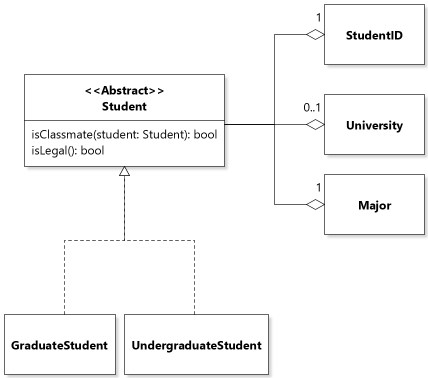
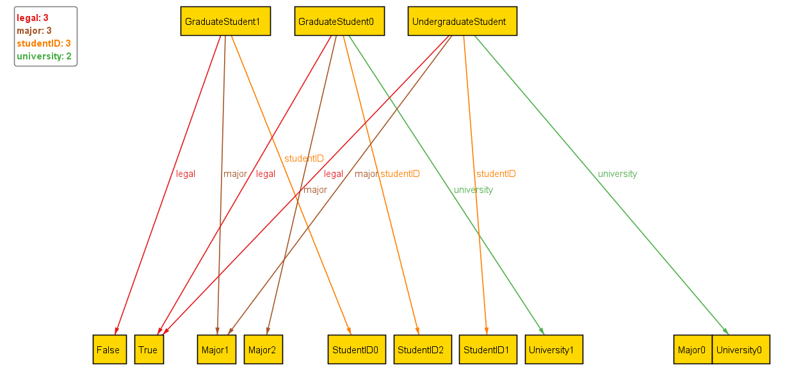
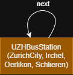

# Formal Modeling
## Task 1a
I used [JetUML](https://www.jetuml.org/) for the class diagram. 



### Notes
* Based on requirements alone, classmates could have stayed simple a predicate. Initially we used a method `isClassmate` given to each student. Based on requirements alone, this would have been correct. The downside is, this can not be visualized nicely via UML and as it later turned out, also not with Alloy. 
* So we decided to adjust and now say that each student holds a list of all their classmates. Implementation-wise this may be questionable but now classmates are visible in the UML diagram. 
* What is still hard to visualize with UML is what students constitute as classmates. This predicate logic is what Alloy excels at.


## Task 1b
* Alloy does not have in-built booleans, so we make our own, see [docs](https://alloy.readthedocs.io/en/latest/modules/boolean.html)

### Model
```
abstract sig Bool {}
one sig True, False extends Bool {}

sig University {}
sig Major {}
sig StudentID {}

abstract sig Student {
    studentID  : one StudentID,
    legal      : one Bool,
    major      : one Major,
    university : lone University,
    classmates : set Student
}

sig GraduateStudent extends Student {}
sig UndergraduateStudent extends Student {}

fact uniqueStudentIDs {
    all disj s1, s2 : Student | s1.studentID != s2.studentID
}

fact legalFact {
    all s : Student | (some s.university) iff (s.legal = True)
}

fact classmatesFact {
    all s : Student | s.classmates = { other : Student | validClassmates[s, other] }
}

pred validClassmates[s1, s2 : Student] {
    s1 != s2
    s1.major = s2.major
    s1.university = s2.university
    (
        (s1 in GraduateStudent and s2 in GraduateStudent)
        or
        (s1 in UndergraduateStudent and s2 in UndergraduateStudent)
    )
}


pred show {}
run show for exactly 2 University,
           exactly 3 Major,
           exactly 3 Student,
           exactly 3 StudentID
```
### Visalization


### Notes:
In the Alloy visualization, classmates are now visible because they are present as an attribute of the student. If we had used the predicate alone, even if alloy had enforced it, it did not visualize it.
* Note: If you re-run this Alloy code, you may have to run it several times as Alloy can generate cases with 3 students, 3 students ids and 3 majors but no classmates.

## Task 2a
Since `but 1 UZHBusStation` from `run show for 2 but 1 UZHBusStation`, only one UZH Bus Station can exist. Since there exists only one UZH Bus Station, each name `ZurichCity`, `Irchel`, `Oerlikon`, and `Schlieren` must point to this one station. Since `all s: UZHBusStation | UZHBusStation in s.^next and some s.next`, all bus stations must be reachable from every station through next and according to `next: set UZHBusStation`, each station must have a next station. However, since there is only one UZH Bus Station, the only way to do it is to have a self-loop. Since `all b1, b2: UZHBus | b1.station != b2.station`, UZHBus must be empty because this rule includes the case `b1 = b2`, which would require a bus's station to differ from itself, which is impossible.



### Use of AI
Since Alloy syntax is very new, AI was used to help better understanding syntax. In a specific case, Claude has been consulted to explain the intricates of the `all b1, b2: UZHBus | b1.station != b2.station` predicate. Everything written in Alloy code is explainable by us. 